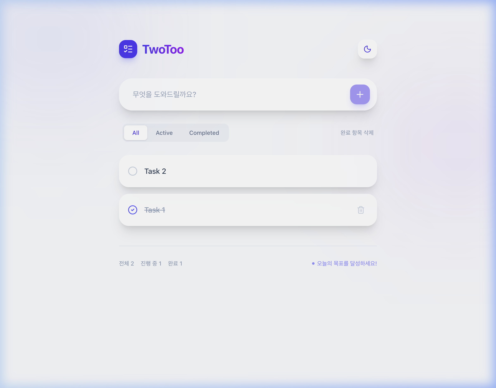

# 📱 투투앱 (TwoToo App)

> **심플하고 프리미엄한 오늘 할 일 관리, 투투**
> 
> 복잡한 기능은 빼고, 부드러운 애니메이션과 직관적인 UI로 오늘 하루의 성취를 기록하세요.



---

## ✨ 핵심 기능
- 🎨 **프리미엄 UI/UX**: Glassmorphism 디자인과 Indigo/Purple 그라데이션 테마.
- 🌙 **다크 모드**: 시스템 설정 및 수동 전환을 지원하는 완벽한 다크 모드.
- ⚡ **실시간 피드백**: Framer Motion을 활용한 부드러운 리스트 전환 및 인터랙션.
- 💾 **데이터 영속성**: 브라우저 로컬 스토리지를 활용하여 새로고침 후에도 데이터 유지.
- 📊 **상태 관리**: 전체, 진행 중, 완료 항목 필터링 및 통계 제공.

---

## 🛠 기술 스택
- **Framework**: React 19 (Vite)
- **Language**: TypeScript
- **Styling**: Tailwind CSS v4
- **Animation**: Framer Motion
- **Icons**: Lucide React

---

## 🏗️ 개발 및 운영 (Harness Builder Team)
이 프로젝트는 **Harness Builder Team** 메타-에이전트 시스템에 의해 구축 및 관리됩니다.

- **빌더 팀 구조**:
  - `00-harness-pm`: 요구사항 분석 및 로드맵 설계
  - `00-doc-architect`: SSOT 문서(PRD, Architecture) 관리
  - `00-team-architect`: 전문가 에이전트 팀 구성 및 MCP 연동
  - `00-security-enforcer`: 보안 룰 및 품질 표준 강제
  - `00-qa-gate`: 최종 산출물 무결성 검증

- **상세 설계 문서**:
  - [PRD.md](./docs/PRD.md): 제품 요구사항 명세서
  - [ARCHITECTURE.md](./docs/ARCHITECTURE.md): 기술 구조 및 설계
  - [ROADMAP.md](./docs/ROADMAP.md): 전체 개발 현황 및 단계
  - [EXAMPLES.md](./docs/EXAMPLES.md): 실제 구축 사례 (투투앱)
  - [RULES.md](./docs/RULES.md): 보안 및 품질 표준

---

## 🚀 실행 방법

```bash
# 의존성 설치
cd demo
npm install

# 개발 서버 실행
npm run dev

# 빌드 및 미리보기
npm run build
npm run preview
```

---

## 🛡️ 보안 점검 결과
- [x] API 키 및 비밀번호 하드코딩 없음
- [x] `.env.local` 파일 git 추적 방지 (.gitignore 설정 완료)
- [x] 개인 식별 정보(이메일, 전화번호 등) 노출 없음

---

## 📄 License
MIT License
