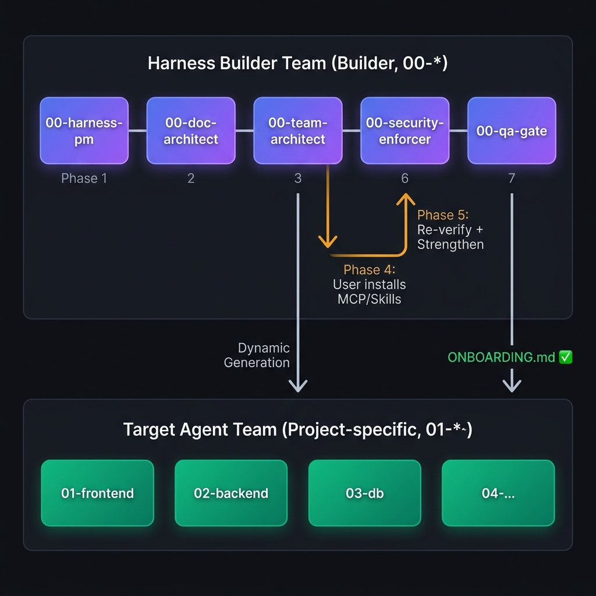
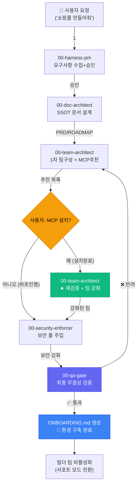

# Harness Builder Team — Why We Built This

> AI가 AI 개발 환경을 스스로 설계하는 메타-에이전트 시스템

---

## 문제 인식: AI는 강력한데, 왜 매번 처음부터 시작해야 하나?

AI 코딩 어시스턴트를 사용해본 사람이라면 공통된 경험이 있습니다.

- 새 프로젝트를 시작할 때마다 AI에게 **기술 스택, 코딩 규칙, 프로젝트 구조**를 반복해서 설명해야 합니다.
- AI가 최신 문서 대신 **사전 학습된 낡은 정보**로 코드를 작성해서 버그가 납니다.
- 여러 에이전트가 **같은 파일을 동시에 수정**하다가 충돌이 납니다.
- 보안 규칙을 매번 직접 챙겨야 하고, 빠뜨리면 API 키가 소스코드에 그대로 남습니다.

**핵심 질문:** AI가 이 모든 초기 세팅을 스스로 해줄 수 있지 않을까?

---

## 해결책: 에이전트가 에이전트를 만드는 시스템

Harness Builder Team은 "메타-에이전트"입니다.

```
사용자: "쇼핑몰 만들어줘"
   ↓
Harness Builder Team이 분석
   ↓
최적의 전문가 에이전트 팀을 자동 생성
   ↓
사용자는 생성된 팀으로 바로 개발 시작
```

일반 AI 코딩 어시스턴트와의 차이:

| | 일반 어시스턴트 | Harness Builder Team |
|---|----------------|---------------------|
| 팀 구성 | 사용자가 매번 설명 | 자동 생성 |
| 최신 문서 | 사전 학습 의존 | 실시간 웹 검색 필수 |
| 보안 룰 | 빠뜨리기 쉬움 | 강제 주입 |
| 품질 검증 | 없음 | 10개 항목 자동 검증 |
| 기획 변경 | 다시 설명 | PRD 수정 → 팀 자동 업데이트 |

---

## 시스템 아키텍처

### 아키텍처 다이어그램 (Visual)



### 상세 프로세스 플로우 (Mermaid)



### 2계층 구조

**Layer 0 — Builder Team (`00-*`)**
프로젝트 환경 세팅 전담. 세팅 완료 후 자동 비활성화.

| 에이전트 | 역할 | 트리거 |
|---------|------|--------|
| `00-harness-pm` | 요구사항 수집 + HITL 승인 게이트 | "하네스 세팅 진행해" |
| `00-doc-architect` | PRD/ARCHITECTURE/ROADMAP 문서화 | "00-doc-architect 진행해" |
| `00-team-architect` | 타겟 팀 동적 생성 + MCP 추천/재검증 | "00-team-architect 진행해" |
| `00-security-enforcer` | 보안 룰 강제 주입 | "00-security-enforcer 진행해" |
| `00-qa-gate` | 10개 항목 무결성 검증 | "00-qa-gate 진행해" |

**Layer 1 — Target Team (`01-*~`)**
실제 개발 수행. Builder 팀이 프로젝트별로 동적 생성.

---

## 7단계 파이프라인 설계

### 왜 7단계인가?

각 단계는 **단일 책임 원칙**을 따릅니다. PM이 보안 룰을 주입하거나, 보안 에이전트가 코드를 작성하는 일이 없도록 역할을 분리했습니다.

```
Phase 1: 요구사항 수집 (사용자 ↔ AI 합의)
Phase 2: 문서화 (SSOT 확립)
Phase 3: 팀 구성 + 도구 추천
Phase 4: 도구 설치 (사용자 선택)     ← 이 단계가 핵심 차별화
Phase 5: 재검증 + 팀 강화           ← 도구 설치 후 에이전트 업그레이드
Phase 6: 보안 강화 (독립 에이전트)
Phase 7: 품질 검증 (독립 에이전트)
```

### 핵심 차별화: 반복 검증 루프 (Phase 4-5)

1차 팀 구성 후 MCP/Skills를 설치하면, 시스템이 이를 **자동 감지**하여 에이전트 Instructions를 강화합니다.

```
예시:
context7 MCP 설치 감지
→ 모든 에이전트에 "context7로 최신 문서 참조" 지시 자동 추가

Supabase MCP 설치 감지
→ DB 에이전트에 "Supabase MCP로 스키마 직접 조회" 지시 자동 추가
```

---

## 하네스 엔지니어링 (Harness Engineering)

이 시스템은 야생마 같은 AI의 강력한 능력을 길들여서 안전하고 예측 가능한 경로로 유도하는 **'AI 제어 공학'**적 접근을 따릅니다.

### 1. 결정론적 제약 (Deterministic Constraints)
AI에게 "열심히 해"라고 부탁하는 대신, **"이 파일 외에는 건드리지 마"**, **"이 명령어는 절대 쓰지 마"**와 같이 명확한 물리적/논리적 한계를 설정합니다.

### 2. 검증 루프 (Validation Loops)
모든 산출물은 독립된 감시 에이전트(`00-qa-gate`)를 통해 체크리스트 기반으로 끊임없이 검증받습니다. 결함 발견 시 사람이 아닌 시스템에 의해 즉시 반려됩니다.

### 3. 컨텍스트 격리 (Context Isolation)
모든 정보를 한꺼번에 던져주지 않고, 단계별로 필요한 정보만 노출하는 **Progressive Disclosure** 기법을 통해 AI의 환각(Hallucination)을 원천 차단합니다.

---

## 하네스 엔지니어링 실무 원칙

### 1. HITL (Human-in-the-Loop)

모든 Phase 완료 후 사용자의 명시적 승인을 받습니다. AI가 혼자 폭주하지 않습니다.

### 2. 네거티브 제약 (Negative Constraints)

각 에이전트는 "할 수 있는 것"보다 **"하면 안 되는 것"** 을 더 명확하게 정의합니다.

```yaml
# 예시: 00-harness-pm
- 코드 작성 금지
- 문서 설계 금지 (00-doc-architect의 권한)
- 에이전트 생성 금지 (00-team-architect의 권한)
- 사용자 승인 없이 다음 단계 진행 금지
```

### 3. Web Grounding (환각 방지)

모든 에이전트는 MCP/Skills 추천이나 기술 스택 조언 시 **반드시 웹 검색을 수행**합니다. 사전 학습 지식에 의존하지 않습니다.

---

## 주요 설계 결정

### 왜 프로젝트별 설치인가?

글로벌 설치는 다른 프로젝트에 빌더 팀이 끼어드는 간섭 문제를 일으킵니다. 각 프로젝트에 독립적으로 `.agents/skills/` 에 설치합니다.

### 왜 description에 네거티브 트리거인가?

AI Skills는 description 키워드로 활성화됩니다. "하면 안 되는 상황"을 명시하지 않으면 일반 개발 대화에서도 빌더 에이전트가 트리거될 수 있습니다.

### 왜 Dual-Layer Planning인가?

`ROADMAP.md`(전략)와 `PLANNING.md`(전술)를 분리하면 AI의 컨텍스트 윈도우를 절약하고, 완료된 Phase를 1줄 요약으로 아카이빙하여 문서를 경량화할 수 있습니다.

### 왜 Boundary 섹션이 필수인가?

여러 에이전트가 동시에 작업할 때 같은 파일을 수정하는 충돌을 방지합니다. 각 에이전트의 파일 접근 범위를 명시적으로 선언합니다.

---

## 실제 사용 결과 (투투앱 데모)

프로젝트: 커플 챌린지 앱 (Vite + React + Tailwind)

```
사용자 입력: "투투앱 만들기"
   ↓
Phase 1: INTAKE_FORM 분석 → 커플 챌린지 앱 확인 (30초)
Phase 2: PRD + ARCHITECTURE + ROADMAP 자동 생성 (1분)
Phase 3: 2개 타겟 에이전트 생성 + 3개 MCP 추천 (2분)
Phase 5: context7 + sequential-thinking 감지 → 에이전트 강화 (30초)
Phase 6: 보안 룰 주입 (30초)
Phase 7: 9/9 QA 통과 → ONBOARDING.md 생성 (30초)
총 소요 시간: 약 5분
```

---

## 파일 구조

```
harness-builder-team/
├── README.md
├── docs/
│   ├── architecture.png      ← 시스템 아키텍처 다이어그램
│   ├── GUIDELINES.md         ← 상세 사용 가이드
│   ├── QUICKSTART.md         ← 5분 빠른 시작
│   ├── EXAMPLES.md           ← 실제 사용 예시
│   └── CONTRIBUTING.md       ← 기여 방법
│
└── .agents/skills/
    ├── 00-harness-pm/
    ├── 00-doc-architect/
    ├── 00-team-architect/
    ├── 00-security-enforcer/
    └── 00-qa-gate/
```
